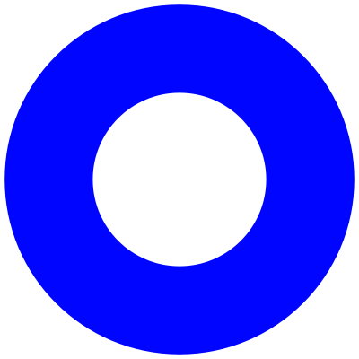
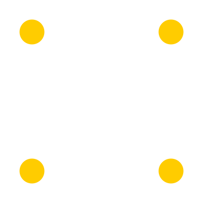

# Azulejo

## Brief exercice — Design génératif

A partir du fichier [starter.zip](./starter.zip), réalisez une déclinaison de la grille de sorte que les images produites soit originales.

Les moyens pour y parvenir sont :
- le design des [primitives (svg)](./starter/assets) via n'importe quel logiciel (illustrator, figma etc.)
  

	
	
	
	
  

- le code javascript [(main.js)](./starter/main.js#L56-L71), par la modification des règles qui commandent l'ajout de nouvelle `
`.
  Il s'agit ici de contrôler l'apparition des images en ajustant la probabilité d'apparition, ex:
  - `if (Math.random() < 0.9) {...}`: très fréquent (90% de chance d'apparaître)
  - `if (Math.random() < 0.1) {...}`: rare (10% de chance d'apparaître)

<image src='./azulejos.jpg' width='500'>

[Azulejo sur wikipédia](https://en.wikipedia.org/wiki/Azulejo)
