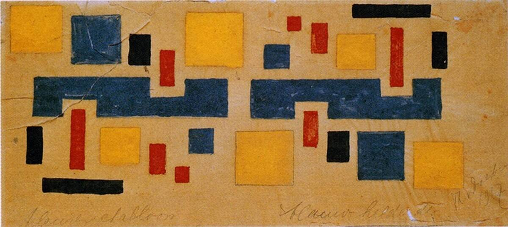

# À la manière de "De Stijl"

sujet à venir

Wikipédia

Kleurontwerp voor ornamentrand in Huis De Lange in Alkmaar, 1917
 Colour design for decorative border in the De Lange House, Alkmaar
 Theo Van Doesburg

Compositie IX, 1917
 Theo Van Doesburg

https://afasiaarchzine.com/2015/06/theo-van-doesburg/
