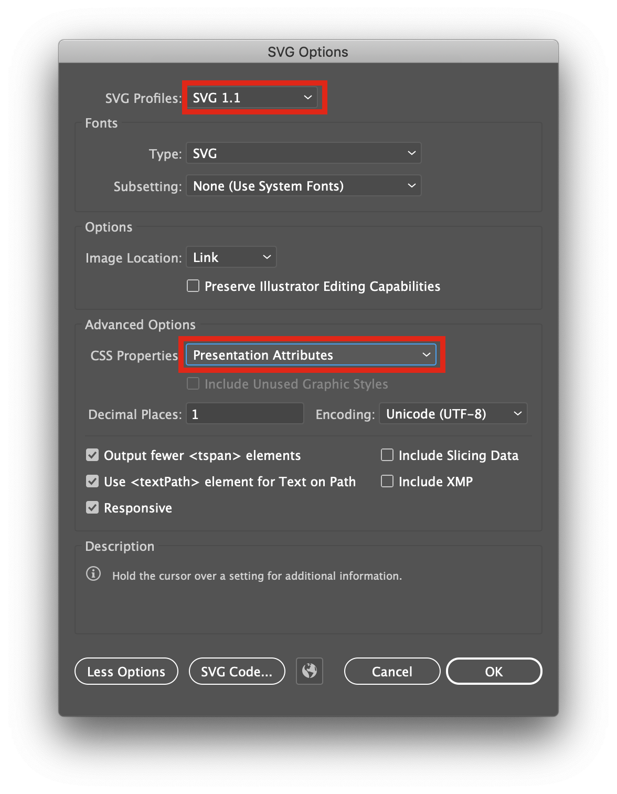

# exercice SCROLL

## Brief

### Résumé
À partir de l'exemple suivant [/scroll-experience](https://jniac.github.io/e-artsup/javascript/exercise-scroll/scroll-experience/) [(source zip)](https://github.com/jniac/e-artsup/blob/master/javascript/exercise-scroll/scroll-experience.zip?raw=true), imaginez une courte expérience web se déroulant lors du "scroll".

### Contraintes
La page web doit contenir 4 `<section>`, c'est à dire 4 écrans. Chaque écran doit mettre en scène une composition [**graphique**](https://en.wikipedia.org/wiki/Graphic_design) [**animée**](https://fr.wikipedia.org/wiki/Animation_(audiovisuel)).

L'ensemble des ressources zippé doit peser moins de 10Mo (attention donc à la compression vidéo, si vidéo...).

### Cadre créatif
Le cadre est volontairement très ouvert. Il s'agit moins d'imaginer une expérience 'réaliste' que de s'amuser dans un cadre ouvert qu'il conviendra néanmoins de définir succinctement.

Exemple de cadre :
- Fan page (groupe de musique, hobby ...)
- Page produit / publicité (shop, manifeste ...)
- Communication (évènement, festival ...)
- Digital Art (graphic design, motion design ...)

### Critère d'évaluation du travail

- Design graphique (couleur, forme, composition).
- Design interactif (UI/UX, feedback).
- Motion design (qualité des animations/transitions).
- Programmation, développement (HTML/CSS, javascript).
- Originalité de la proposition.

### Informations complémentaires

[Atom](https://atom.io/) et Chrome sont les 2 seuls logiciels indispensables pour la réalisation de l'exercice.  
MediaEncoder peut être utile pour l'édition simple de vidéo (recadrage, timecode, compression).  
Illustrator peut produire des SVG, mais c'est pas fou (comme toute la suite Adobe).

Depuis Illustrator, pour exporter un svg facile à manipuler, il est préférable de choisir l'option `Presentation Attributes` dans la fenêtre d'exportation.

Liens utiles :
- [Mozilla Developer Network (MDN)](https://developer.mozilla.org/fr/)  
  La documentation présente ici est excellente (elle est même traduite en français, zéro excuse). Elle concerne tout le web (HTML, CSS, JS).

  Exemple d'usage, recherche google : [mdn flex](https://www.google.com/search?q=mdn+flex&oq=mdn+flex&aqs=chrome..69i57j0l7.2414j0j4&sourceid=chrome&ie=UTF-8)

  Exemple particulier de documentation : [MDN Array (tableaux en js)](https://developer.mozilla.org/fr/docs/Web/JavaScript/Reference/Objets_globaux/Array).

- [Le SVG est un format d'image](https://fr.wikipedia.org/wiki/Scalable_Vector_Graphics) extrêmement versatile, et donc puissant. Le SVG est l'ami du digital motion designer.

  2 liens me semblent particulièrement intéressant pour apprendre à exploiter les possibilités du SVG.
  - [la page de MDN (encore)](https://developer.mozilla.org/fr/docs/Web/SVG/Element) listant les différentes balises du SVG.
  - [la page de GSAP/TweenMax dédiée à l'animation des SVG](https://greensock.com/svg-tips/)

- [GSAP / TweenMax](https://greensock.com/gsap/) est un super framework d'animation en JS. [La page 'ease visualizer'](https://greensock.com/ease-visualizer/) est un passage obligatoire pour tout bon motion designer.

- [Awwwards](https://www.awwwards.com/), [FWA](https://thefwa.com/) pour l'inspiration en design web. [Motiongrapher](http://motionographer.com/) pour le motion design. Dribble, Pinterest etc.

- [Three JS](https://threejs.org/) (3D temps réel dans le navigateur) pour les énervés. Là aussi la documentation est excellente (mais en anglais uniquement), [les exemples](https://threejs.org/examples/#webgl_interactive_cubes_ortho) couvrent plus de problématiques que votre imagination n'en autorise.

- [La page github du kit-js](https://jniac.github.io/js-kit/test/random/) que je mets à disposition, avec notamment [une page démo de kit.Random.](https://jniac.github.io/js-kit/test/random/)
