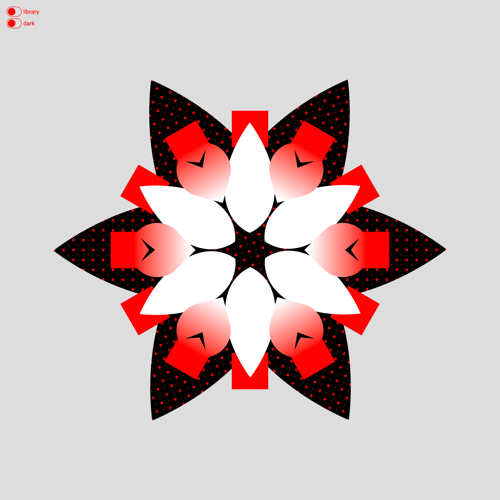

# flowers-dom

fleurs en HTML / CSS

[version en ligne](https://jniac.github.io/education/javascript/flowers-dom/flowers-dom/)  
[fichiers source zippés (flowers-dom.zip)](https://github.com/jniac/education/raw/master/javascript/flowers-dom/flowers-dom.zip)

Un bouton "toggle" permet de changer le "theme" de la fleur.

light theme

dark theme

