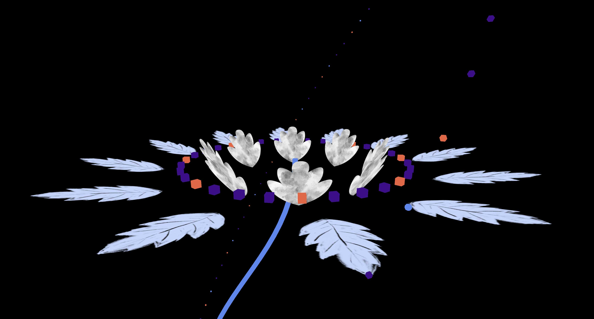

# Shooter

Fleurs réalisées avec ThreeJS.

[version en ligne](https://jniac.github.io/education/javascript/flowers-webgl/flowers-webgl/)  
[fichiers source zippés (flowers-webgl.zip)](https://github.com/jniac/education/raw/master/javascript/flowers-webgl/flowers-webgl.zip)

dark theme

