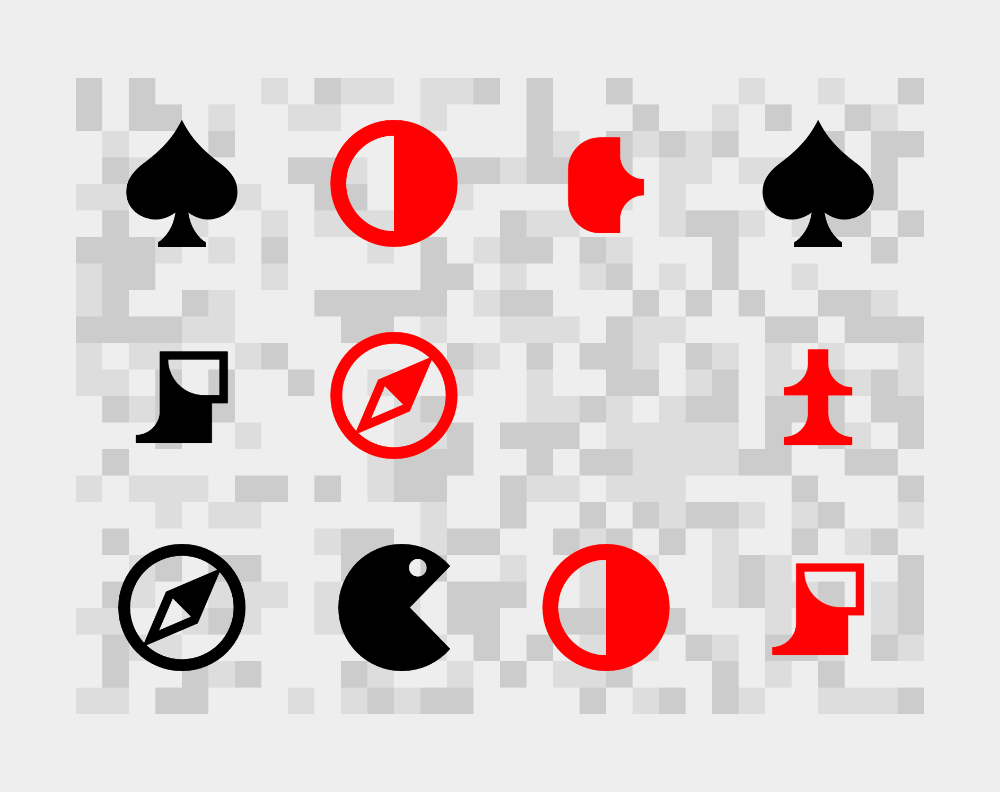
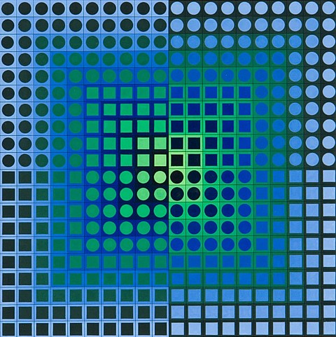
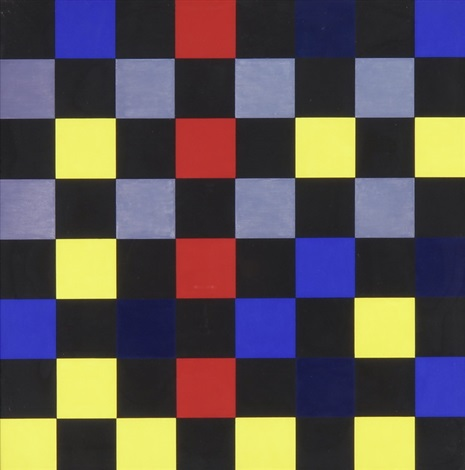
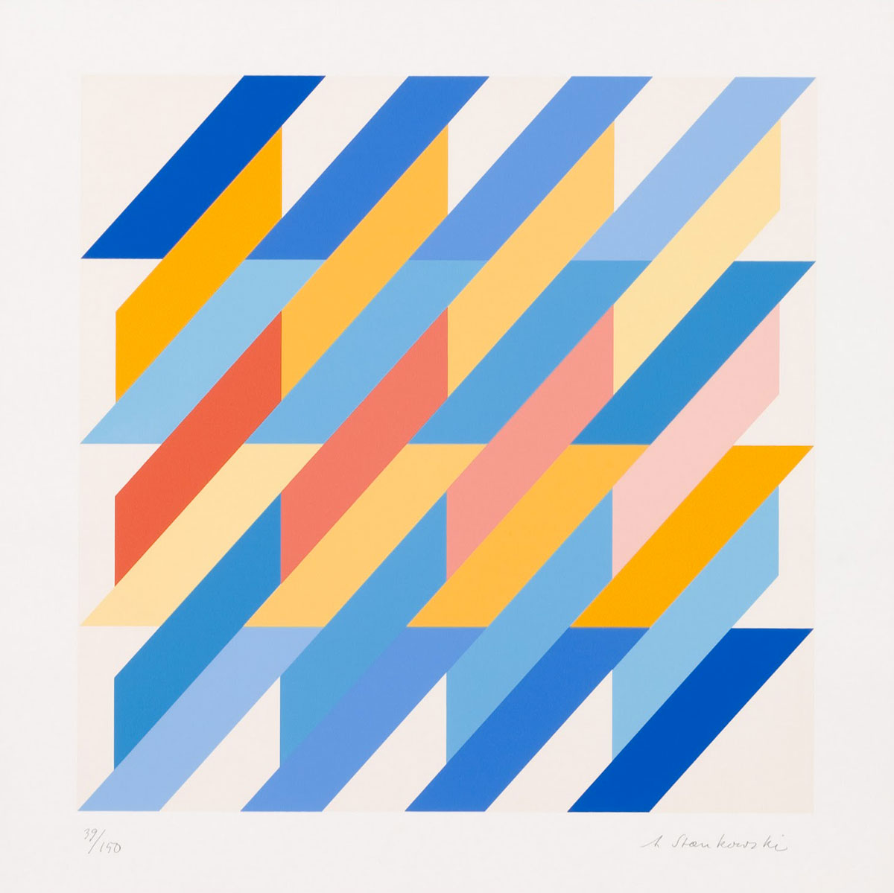

# Une grille
Svg + font icon  
[fichier source grid-start.zip](./grid-start.zip?raw=true)

<p align="center"></p>
<p align="center">
Une base sobre à modifier
</p>

- [Attentes, enjeux](#attentes-enjeux)
- [Critères d'évaluation](#critères-dévaluation)
- [Icomoon](#icomoon)
- [getRandomColor()](#getrandomcolor)
- [Références artistiques ](#références-artistiques)

## Attentes, enjeux
- Produire un jeu d’icône original à partir de l’application en ligne [icomoon/app](https://icomoon.io/app/#/select).
- Maîtriser les règles aléatoires des fonctions « getRandomColor() » pour produire une gamme de couleur originale cohérentes (contraste, dominante).
- Enjeu artistique / design : 

## Critères d'évaluation
Hm, la vrai évaluation c'est vous qui la ferez, en votre âme et conscience. "Qu'ai-je appris ? Que suis-je capable de faire que je ne savais pas faire avant ?". Pour ma part, puisqu'il faut vous évaluer, voici les critères retenus : 
- Mise en œuvre technique (Javascript, CSS, icomoon) **50%**
- Sensibilité artistique (comment avec du code faire du beau et de l'original, ou comment faire passer sa sensibilité dans la programmation). **50%**
- Originalité / Grain de folie. Parce qu'il est toujours possible de trouver un usage nouveau, inattendu. Et que c'est par là que passe la nouveauté, et derrière l'avenir. Rien que ça. **50%**

Les plus attentifs remarqueront que la somme des critères dépasse 100%. C'est exact. C'est parce que ce dernier critère est facultatif, il n'est pas toujours atteignable, et il n'est même pas souhaitable de toujours le poursuivre. Mais il mérite toutefois d'être distingué. C'est cadeau, c'est bonus donc !


## Icomoon 
- Créer des icones sur illustator (ex: 64 x 64px, forme en noir sur fond blanc).
- Exporter en svg.
- Glisser déposer dans l'interface d'icomoon.
- Sélectionner les icones ainsi importés, ajouter éventuellement des icones provenant de la selection icomoon.
- Exporter la séléction.
- "Dezipper" le fichier dans le dossier "assets".
- Ajouter dans `style/main.css` un lien vers le fichier `style.css` (exemple: `@import url(../assets/icomoon-v1.0/style.css);`)

## getRandomColor()
Il existe deux fonctions `getRandomColor()` une dans [changeThatIcon.js](./grid-start/src/changeThatIcon.js), l'autre dans [changeThatSvg.js](./grid-start/src/changeThatSvg.js). Il faut les modifier pour produire des ensembles chromatiques faisant intervenir votre sensibilité artistique.

Note : 
Comment comprendre l'expression suivante ?
```javascript
Math.random() < 0.25
```
- `Math.random()` est une fonction renvoyant aléatoirement un nombre entre 0 et 1
- `<` est un opérateur testant l'inferiorité d'un nombre (à gauche de l'opérateur) par rapport à un autre (à droite), cet opérateur renvoie une valeur "booléenne" (`true` ou `false`)
- `0.25` est un nombre écrit en "dur" dans le programme

L'expression `Math.random() < 0.25` sera évaluée comme vrai (`true`) dans 25% des cas.

Ainsi dans le code suivant :
```javascript
const getRandomColor = () => {
    if (Math.random() < 0.8) {
        return 'blue'
    } else {
        return 'red'
    }
}
```
La fonction `getRandomColor` renvoie `"blue"` dans 80% des cas, `"red"` dans 20%.

A vous de jouer avec ces expressions pour obtenir une gamme chromatique intéressante (avec des teintes dominantes, et d'autre plus rares). 

## Références artistiques

<p align="center"></p>
<p align="center">
Victor Vasarely — Zoeld V (1967)
</p>

<p align="center"></p>
<p align="center">
Aurélie Nemours - Échiquier I (1972)
</p>

<p align="center"></p>
<p align="center">
Anton Stankowski
</p>
