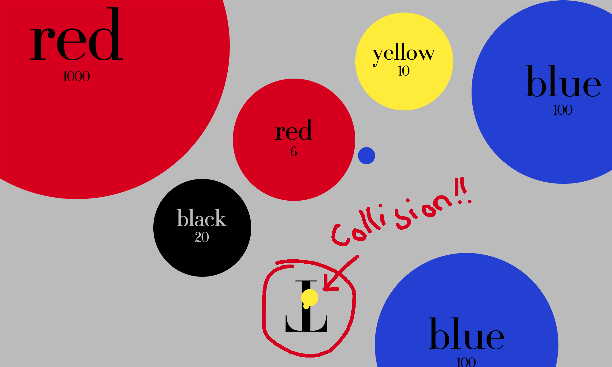

# Shooter

[version en ligne](https://jniac.github.io/education/javascript/shooter/shooter/)  
[fichiers source zippés (shooter.zip)](https://github.com/jniac/education/raw/master/javascript/shooter/shooter.zip)

Difficile, difficile d'avoir cet écran :  

<p align="center">
    
<p>
<p align="center">
    YOU WIN!!!
</p>

## comprendre le code
Le code ne contient quasiment aucun commentaire.  
En revanche il a été écrit de telle manière qu'il se veut "lisible".  
Reste que la lecture peut être déroutante.  

Un exemple sur le code servant à détecter la collision entre le joueur et une particule :  
<p align="center">
    
<p>
<p align="center">
    Une collision.
</p>

[Code source ici.](./shooter/src/core/player.js#L52-L63)
```javascript
const update = () => {
    //...
    // pour toute particule de la collection 'particles.particles'
    for (const particle of particles.particles) {
        // si la particule est du type "basic"
        if (particle.type === 'basic') {
            // la particule est-elle bleu ou jaune ?
            const particleIsBlueOrYellow = particle.color === colors.BLUE || particle.color === colors.YELLOW
            // si la particule est bleu ou jaune
            if (particleIsBlueOrYellow) {
                // alors on calcule une distance, en incluant une tolérance (à l'avantage du joueur)
                const gameplayTolerance = 0.9
                const collisionDistance = (radius + particle.radius) * gameplayTolerance
                // si la distance calculée entre la particule et la position du joueur
                // est inférieure à la distance de collision
                if (distance(particle.position, position) < collisionDistance) {
                    // et bien c'est gameover !
                    gameover(particle)
                }
            }
        }
    }
}
```
