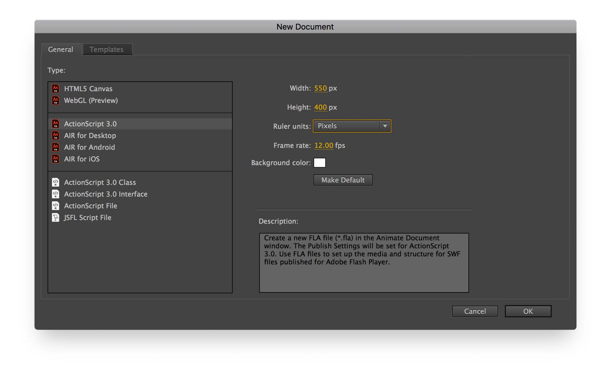
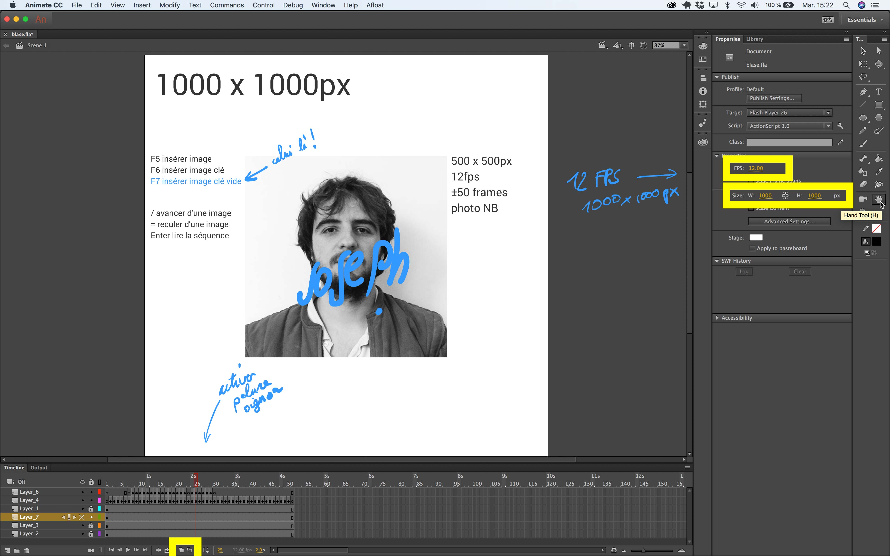
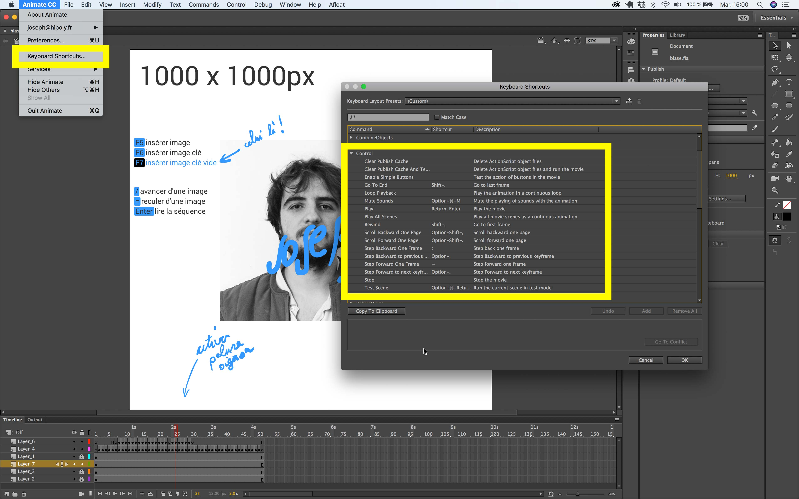

# affiche ton blase !

## Animate:

Le projet :
- ActionScript 3.0 (bien qu'on s'en cogne en vrai)
- format document 1000 x 1000 px
- format portrait 500 x 500 px (250px de marges tournantes)
- 12 fps

  

rappel configuration de l'interface :
régler [/] [+] comme commandes pour reculer / avancer d'une image :

  

---

  

note:
### plugin Adobe Media Encoder
Pour pouvoir encoder en [WebM (format open source Chrome Opera Firefox)](https://fr.wikipedia.org/wiki/WebM)
http://www.fnordware.com/WebM/

### Atom.io video preview
https://atom.io/packages/videoplayer  
Installer le package sous Atom :
- Settings: `cmd/ctrl + ,`
- **+ Install**
- search : _videoplayer_ + install
