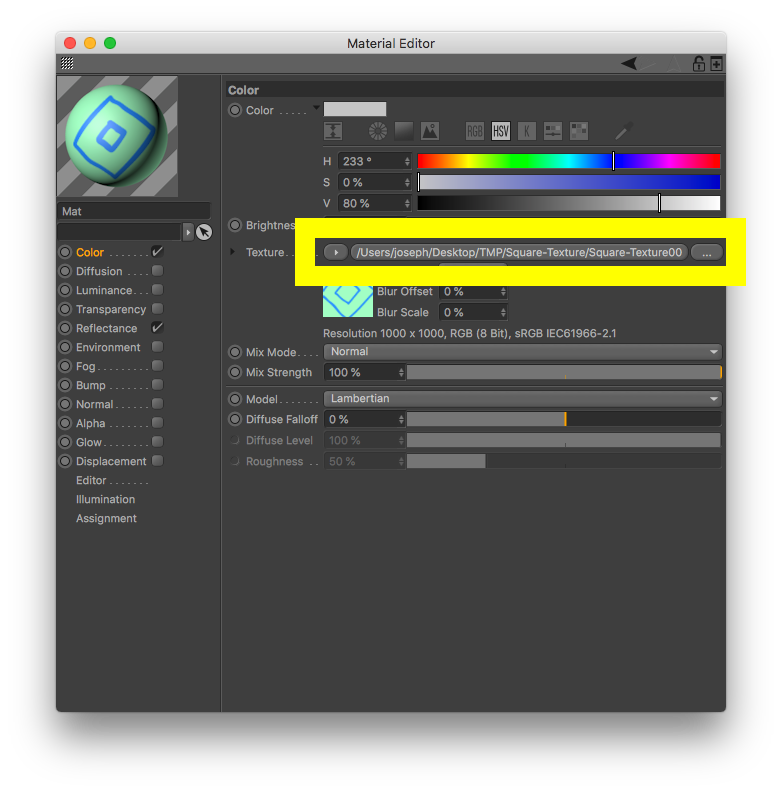
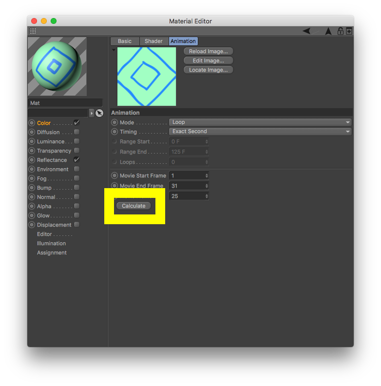
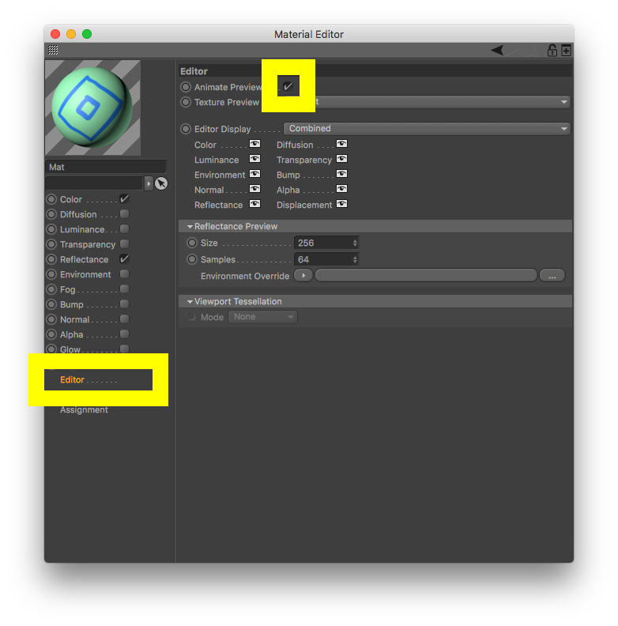

# Texture animée dans Cinema4D

[Animated-Texture.c4d](./Animated-Texture.c4d)

### Chemin
Préciser à Cinema4D le chemin de la première image de la séquence d'image.  

ATTENTION: 
- Soit le fichier se trouve déjà dans un dossier `tex` à la racine du fichier `xxx.c4d` 
- Soit le fichier n'est pas au bon endroit et il ne PAS laisser Cinema4D déplacer le fichier (car alors il ne déplacera que la première image et pas la séquence entière).

### Animation

Pour que Cinema4D interprète la séquence d'animation il faut éditer la texture (en cliquant dessus) :
- Dans l'onglet Animation cliquer sur 'Calculate' (Si le dossier contient plusieurs images correctement nommées, Cinema4D déduit automatiquement les indices de la première et dernière images)

### Preview

Pour avoir un aperçu dans le viewport de la texture animée.
- Editor > cocher "Animate Preview"

