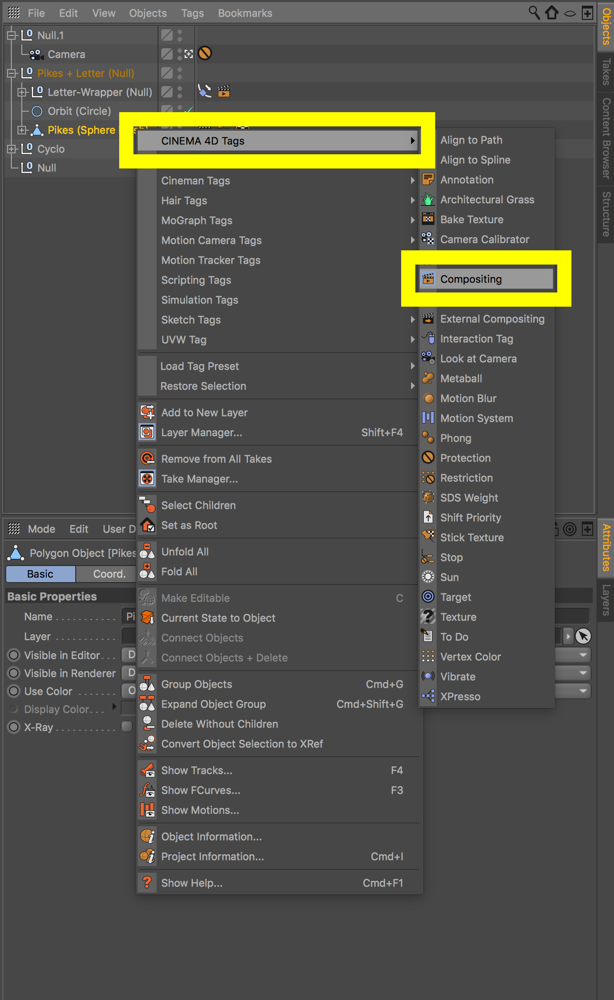
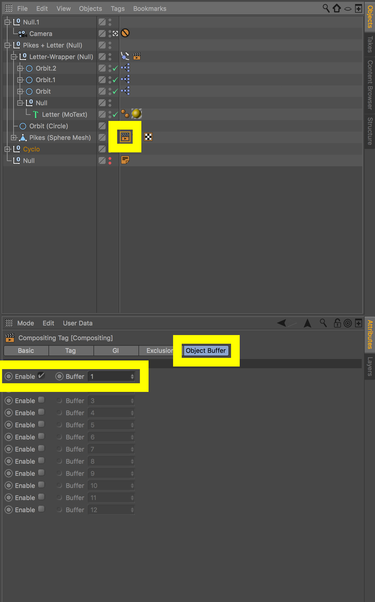
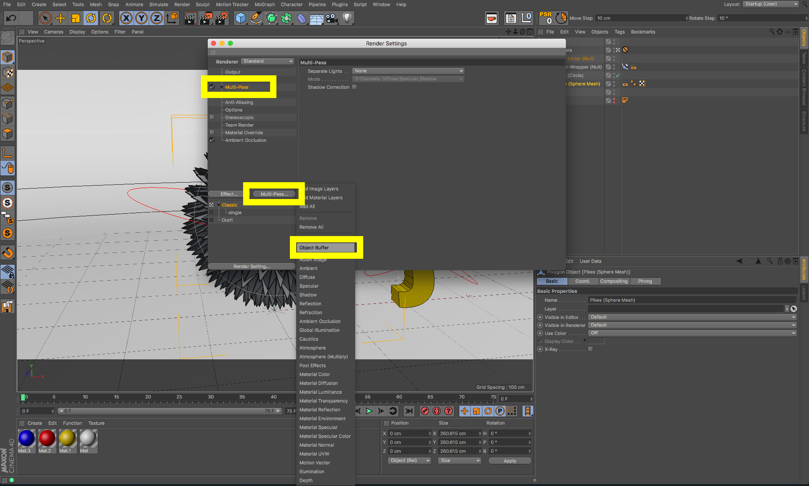
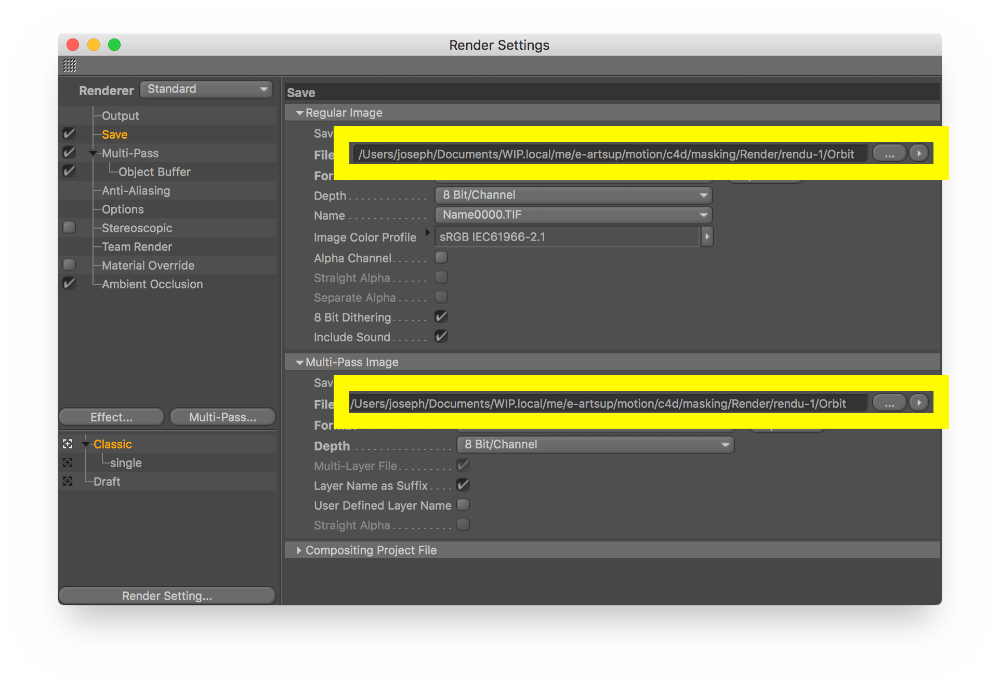
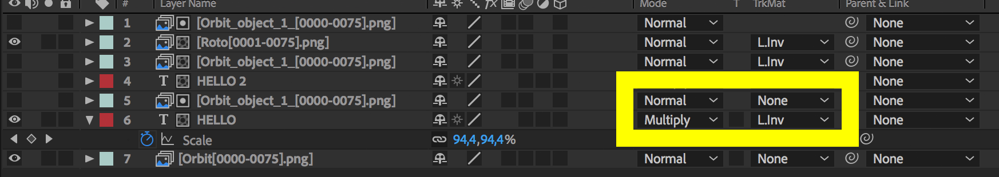

# Techniques avancées : Masque d'objet

Pour pouvoir réaliser des incrustations en post-production il est souvent nécessaire de rendre des "passes d'objet" depuis le logiciel de 3D.

Ces passes serviront de masque (Luma Matte) dans After Effect et permettront de réaliser des incrustations, des corrections colorimétriques spécifiques etc.

## Compositing Tag

Tout commence avec le tag **Compositing** que l'on ajoute sur l'objet dont on veut extraire un masque (ici la sphère avec des piques).

clic droit > Cinema 4D Tags > Compositing

Sur le tag il faut activer une passe d'objet.

## Render Settings

Pour rendre la passe d'object il faut ensuite aller dans les paramètres de rendu, activer **Multi-Pass**.

Il ne reste plus qu'à spécifier un chemin de sortie (Save) pour le rendu classique ET la passe d'objet.

## After Effects

Dans After Effects la passe d'objet s'importe comme n'importe quel métrage.

Une fois ajouté dans la composition. Il faut masquer le calque concerné en Luma Matte

