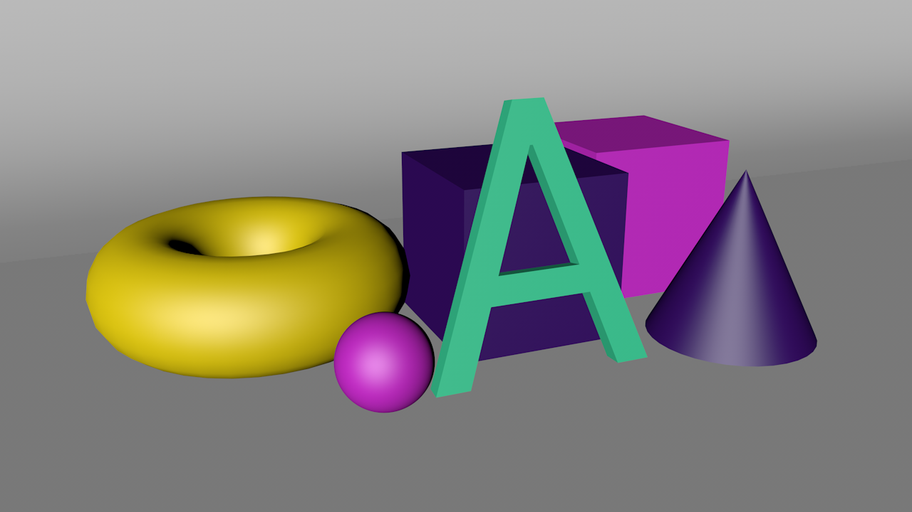
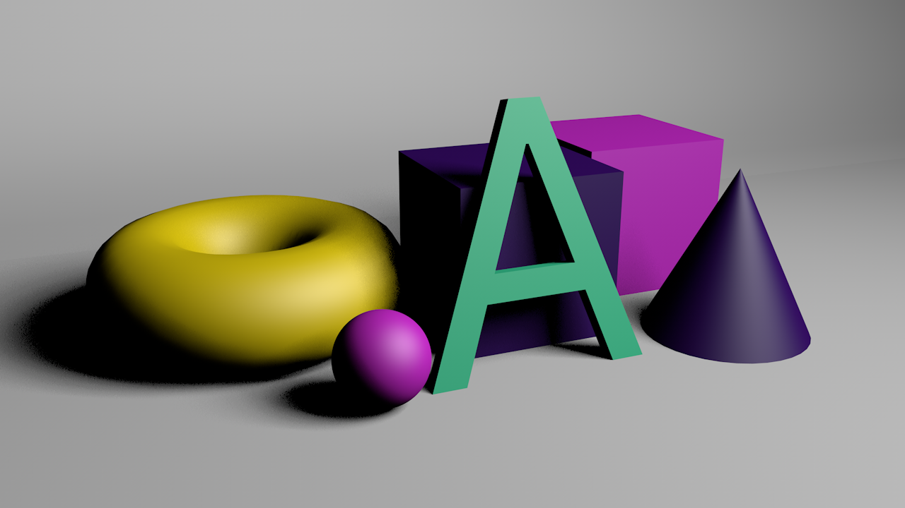
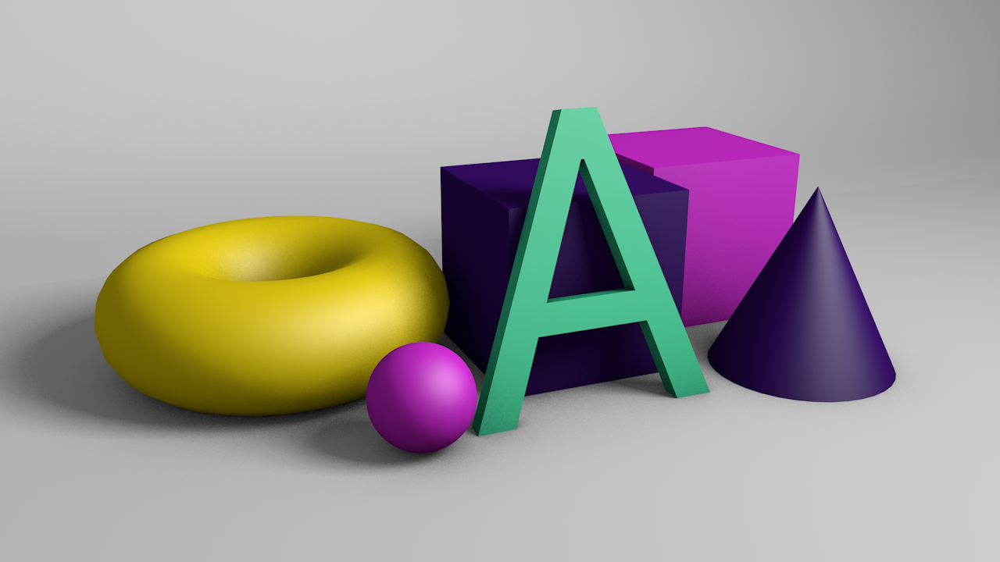

### rendu pas cher

Techniques de rendu classique, utilisant les moteurs classiques (Standard / Physical) de Cinema4D.
 

# étape 0
Quelques objets, un cyclo...  
rendu de base (pas de lumière, pas d'ombre, rien):

 

# étape 1 : Lumière !
La meilleure source de lumière en 3D (quelque soit le moteur de rendu) est toujours un plan diffus (vs Point Light). Le plan diffus (Area) permet d'obtenir des ombres douces (diffuses). La **taille** et l'**orientation** du plan détermineront le dessin des ombres.
- Area Light (+ Area Shadow)

La meilleure façon sous C4D d'ajuster une source de lumière reste de "*voir à travers la lumière*" :
- activer : utiliser l'objet actif (le plan diffus) comme camera, [*Set Active Object as Camera*](./Screen.md#SetActiveObjectAsCamera)
- désactiver : il est important de "ressortir de la lumière" sans quoi l'on risque de modifier l'éclairage par accident, [Use Camera: Default Camera](./screenshots/BackToDefaultCamera.png)

 

# étape 2 : Ambience !
Non, pas ambience, mais Ambient, ou aussi <i>Diffuse</i>, en CG, en compositing, c'est le nom de la passe de rendu qui affiche les matériaux brutes, intégralement éclairés. Cette image est obtenue en ajoutant à la scène [une lumière omnidirectionnelle en éclairage ambient]().

Cette passe peut paraître inutile, elle est fondamentale, c'est elle qui détermine les rapports de masses et de couleurs.

 

# étape 3 : Ambient Occlusion !
**FONDAMENTALE !** Quelque soit le moteur de rendu choisi (C4D, VRay, Octane), la passe d'occlusion ambiente est **FONDAMENTALE**. Elle permet de dessiner les volumes (modelés) sans même la moindre source de lumière.
- Ambient 100%
- Ambient Occlusion <i style='color:red'>(Maximum Ray Length 300cm)</i>

La longueur du rayon maximum ([Maximum Ray Length]()) est un paramètre important. Il permet de contrôler la quantité d'occlusion, la quantité d'ombre que l'on veut voir se dessiner à partir des espaces concaves.

En compositing la passe d'occlusion ambiente sera toujours rendu à part (rendu **multi-pass**), puis ajustée (opacité) pour obtenir l'image idéale.

 

# étape 4 : Mix !
L'étape finale consiste à venir mixer l'occlusion ambiente avec la lumière classique. Un réglage rapide après avoir rétabli le plan diffus consiste à baisser l'intensité de la lumière ambiente à 50%.

- Area Light (+ Area Shadow)
- <i style='color:red'>Ambient 50%</i>
- Ambient Occlusion (Maximum Ray Length 400cm)

Si l'on compare l'image avec celle de l'étape 1 le bénéfice des étapes 2 & 3 (Ambient Light + Ambient Occlusion) est évident : il n'y a plus de grandes ombres noires, la scène est entièrement éclairée.

L'intensité de la lumière ambiente permet de contrôler la densité des ombres.

Rien n'empêche à présent d'ajouter à la scène de nouvelles sources d'éclairage pour enrichir la composition (retour, éclairage latéral).

 

# étape 5 : Fine tuning !

L'étape 5 n'est pas à proprement un réglage de la lumière. Il s'agit à présent d'intervenir sur la modélisation en créant des biseaux pour mettre en valeur les arrêtes.

Plusieurs outils sont à disposition dans Cinema4D. Les objets paramétriques ([primitives](), extrusion, [MoText]()) ont généralement un réglage **Fillet**. Il existe un [Deformer Bevel]() qui lisse de manière non destructive les arrêtes de n'importe quel maillage.

- Area Light (+ Area Shadow)
- Ambient 50%
- Ambient Occlusion (Maximum Ray Length 400cm)
- Bevel / Chamfer / Fillet (lumière sur les arrêtes)

 
 

---  

#### Notes :
Cette note est rédigé en [Markdown]().  
Pour avoir un aperçu d'un fichier markdown (`file.md`) dans Atom, le raccourci clavier est :  
**ctrl + shift + M**
